# PH


--- 
# FlowRate


--- 
# Pressure

```mermaid
%%{init:{
  "flowchart":{"curve":"linear","useMaxWidth":false,"nodeSpacing":180,"rankSpacing":180},
  "themeVariables":{"fontSize":"18px","fontFamily":"Microsoft JhengHei, Arial"}
}}%%
flowchart LR
  %% ===== 前段：顯影 & 水洗 =====
  subgraph DEV["顯影與前段水洗"]
    direction LR
    D1_IN((" ")):::hidden --> D1U["decD1UpSpray<br/>顯影1上噴"]:::n
    D1_IN --> D1D["decD1DownSpray<br/>顯影1下噴"]:::n
    D1U --> D1_OUT((" ")):::hidden
    D1D --> D1_OUT
    
    D1_OUT --> D2_IN((" ")):::hidden
    D2_IN --> D2U["decD2UpSpray<br/>顯影2上噴"]:::n
    D2_IN --> D2D["decD2DownSpray<br/>顯影2下噴"]:::n
    D2U --> D2_OUT((" ")):::hidden
    D2D --> D2_OUT
    
    D2_OUT --> NL_IN((" ")):::hidden
    NL_IN --> NLU["decNewLiquidUpSpray<br/>新液洗上噴"]:::n
    NL_IN --> NLD["decNewLiquidDownSpray<br/>新液洗下噴"]:::n
    NLU --> NL_OUT((" ")):::hidden
    NLD --> NL_OUT
    
    NL_OUT --> OF1_IN((" ")):::hidden
    OF1_IN --> OF1U["decOverFlow1UpSpray<br/>溢流水洗1上噴"]:::w
    OF1_IN --> OF1D["decOverFlow1DownSpray<br/>溢流水洗1下噴"]:::w
    OF1U --> OF1_OUT((" ")):::hidden
    OF1D --> OF1_OUT
    
    OF1_OUT --> OF2_IN((" ")):::hidden
    OF2_IN --> OF2U["decOverFlow2UpSpray<br/>溢流水洗2上噴"]:::w
    OF2_IN --> OF2D["decOverFlow2DownSpray<br/>溢流水洗2下噴"]:::w
    OF2U --> OF2_OUT((" ")):::hidden
    OF2D --> OF2_OUT
    
    OF2_OUT --> OF3_IN((" ")):::hidden
    OF3_IN --> OF3U["decOverFlow3UpSpray<br/>溢流水洗3上噴"]:::w
    OF3_IN --> OF3D["decOverFlow3DownSpray<br/>溢流水洗3下噴"]:::w
    OF3U --> OF3_OUT((" ")):::hidden
    OF3D --> OF3_OUT
    
    OF3_OUT --> OF4_IN((" ")):::hidden
    OF4_IN --> OF4U["decOverFlow4UpSpray<br/>溢流水洗4上噴"]:::w
    OF4_IN --> OF4D["decOverFlow4DownSpray<br/>溢流水洗4下噴"]:::w
    OF4U --> OF4_OUT((" ")):::hidden
    OF4D --> OF4_OUT
    
    OF4_OUT --> OF5_IN((" ")):::hidden
    OF5_IN --> OF5U["decOverFlow5UpSpray<br/>溢流水洗5上噴"]:::w
    OF5_IN --> OF5D["decOverFlow5DownSpray<br/>溢流水洗5下噴"]:::w
    OF5U --> OF5_OUT((" ")):::hidden
    OF5D --> OF5_OUT
    
    OF5_OUT --> OF6_IN((" ")):::hidden
    OF6_IN --> OF6U["decOverFlow6UpSpray<br/>溢流水洗6上噴"]:::w
    OF6_IN --> OF6D["decOverFlow6DownSpray<br/>溢流水洗6下噴"]:::w
    OF6U --> OF6_OUT((" ")):::hidden
    OF6D --> OF6_OUT
  end

  %% ===== 蝕刻 E1~E4 與中段水洗 =====
  subgraph ETCH["蝕刻區與中段水洗"]
    direction LR
    OF6_OUT --> E1_IN((" ")):::hidden
    E1_IN --> E1AU["decE1AUpSpray<br/>真空蝕刻1A上噴"]:::e
    E1_IN --> E1AD["decE1ADownSpray<br/>真空蝕刻1A下噴"]:::e
    E1_IN --> E1BU["decE1BUpSpray<br/>真空蝕刻1B上噴"]:::e
    E1_IN --> E1BD["decE1BDownSpray<br/>真空蝕刻1B下噴"]:::e
    E1AU --> E1_OUT((" ")):::hidden
    E1AD --> E1_OUT
    E1BU --> E1_OUT
    E1BD --> E1_OUT
    
    E1_OUT --> OF7_IN((" ")):::hidden
    OF7_IN --> OF7U["decOverFlow7UpSpray<br/>溢流水洗7上噴"]:::w
    OF7_IN --> OF7D["decOverFlow7DownSpray<br/>溢流水洗7下噴"]:::w
    OF7U --> OF7_OUT((" ")):::hidden
    OF7D --> OF7_OUT
    
    OF7_OUT --> E2_IN((" ")):::hidden
    E2_IN --> E2U["decE2UpSpray<br/>真空蝕刻2上噴"]:::e
    E2_IN --> E2D["decE2DownSpray<br/>真空蝕刻2下噴"]:::e
    E2U --> E2_OUT((" ")):::hidden
    E2D --> E2_OUT
    
    E2_OUT --> OF8_IN((" ")):::hidden
    OF8_IN --> OF8U["decOverFlow8UpSpray<br/>溢流水洗8上噴"]:::w
    OF8_IN --> OF8D["decOverFlow8DownSpray<br/>溢流水洗8下噴"]:::w
    OF8U --> OF8_OUT((" ")):::hidden
    OF8D --> OF8_OUT
    
    OF8_OUT --> E3_IN((" ")):::hidden
    E3_IN --> E3U["decE3UpSpray<br/>真空蝕刻3上噴"]:::e
    E3_IN --> E3D["decE3DownSpray<br/>真空蝕刻3下噴"]:::e
    E3U --> E3_OUT((" ")):::hidden
    E3D --> E3_OUT
    
    E3_OUT --> OF9_IN((" ")):::hidden
    OF9_IN --> OF9U["decOverFlow9UpSpray<br/>溢流水洗9上噴"]:::w
    OF9_IN --> OF9D["decOverFlow9DownSpray<br/>溢流水洗9下噴"]:::w
    OF9U --> OF9_OUT((" ")):::hidden
    OF9D --> OF9_OUT
    
    OF9_OUT --> E4_IN((" ")):::hidden
    E4_IN --> E4U["decE4UpSpray<br/>真空蝕刻4上噴"]:::e
    E4_IN --> E4D["decE4DownSpray<br/>真空蝕刻4下噴"]:::e
    E4U --> E4_OUT((" ")):::hidden
    E4D --> E4_OUT
  end

  %% ===== 後段：止水、退膜、酸洗、加壓水洗、吹乾 =====
  subgraph POST["後段處理"]
    direction LR
    E4_OUT --> STOP_IN((" ")):::hidden
    STOP_IN --> STU["decStopWashingUpSpray<br/>止水洗上噴"]:::w
    STOP_IN --> STD["decStopWashingDownSpray<br/>止水洗下噴"]:::w
    STU --> STOP_OUT((" ")):::hidden
    STD --> STOP_OUT
    
    STOP_OUT --> S1_IN((" ")):::hidden
    S1_IN --> S1U["decS1UpSpray<br/>退膜1上噴"]:::s
    S1_IN --> S1D["decS1DownSpray<br/>退膜1下噴"]:::s
    S1U --> S1_OUT((" ")):::hidden
    S1D --> S1_OUT
    
    S1_OUT --> S2_IN((" ")):::hidden
    S2_IN --> S2U["decS2UpSpray<br/>退膜2上噴"]:::s
    S2_IN --> S2D["decS2DownSpray<br/>退膜2下噴"]:::s
    S2U --> S2_OUT((" ")):::hidden
    S2D --> S2_OUT
    
    S2_OUT --> PICK_IN((" ")):::hidden
    PICK_IN --> PKU["decPicklingUpSpray<br/>酸洗上噴"]:::p
    PICK_IN --> PKD["decPicklingDownSpray<br/>酸洗下噴"]:::p
    PKU --> PICK_OUT((" ")):::hidden
    PKD --> PICK_OUT
    
    PICK_OUT --> PR1_IN((" ")):::hidden
    PR1_IN --> PR1U["decPressureRinse1UpSpray<br/>加壓水洗1上噴"]:::pr
    PR1_IN --> PR1D["decPressureRinse1DownSpray<br/>加壓水洗1下噴"]:::pr
    PR1U --> PR1_OUT((" ")):::hidden
    PR1D --> PR1_OUT
    
    PR1_OUT --> PR2_IN((" ")):::hidden
    PR2_IN --> PR2U["decPressureRinse2UpSpray<br/>加壓水洗2上噴"]:::pr
    PR2_IN --> PR2D["decPressureRinse2DownSpray<br/>加壓水洗2下噴"]:::pr
    PR2U --> PR2_OUT((" ")):::hidden
    PR2D --> PR2_OUT
    
    PR2_OUT --> PR3_IN((" ")):::hidden
    PR3_IN --> PR3U["decPressureRinse3UpSpray<br/>加壓水洗3上噴"]:::pr
    PR3_IN --> PR3D["decPressureRinse3DownSpray<br/>加壓水洗3下噴"]:::pr
    PR3U --> PR3_OUT((" ")):::hidden
    PR3D --> PR3_OUT
    
    PR3_OUT --> PR4_IN((" ")):::hidden
    PR4_IN --> PR4U["decPressureRinse4UpSpray<br/>加壓水洗4上噴"]:::pr
    PR4_IN --> PR4D["decPressureRinse4DownSpray<br/>加壓水洗4下噴"]:::pr
    PR4U --> PR4_OUT((" ")):::hidden
    PR4D --> PR4_OUT
    
    PR4_OUT --> PR5_IN((" ")):::hidden
    PR5_IN --> PR5U["decPressureRinse5UpSpray<br/>加壓水洗5上噴"]:::pr
    PR5_IN --> PR5D["decPressureRinse5DownSpray<br/>加壓水洗5下噴"]:::pr
    PR5U --> PR5_OUT((" ")):::hidden
    PR5D --> PR5_OUT
    
    PR5_OUT --> DRY_IN((" ")):::hidden
    DRY_IN --> GA1["decGale1<br/>強風吹乾壓力1"]:::g
    GA1 --> GA2["decGale2<br/>強風吹乾壓力2"]:::g
    GA2 --> HG1["decHotGale1<br/>強熱風吹乾壓力1"]:::g
    HG1 --> HG2["decHotGale2<br/>強熱風吹乾壓力2"]:::g
    HG2 --> HG3["decHotGale3<br/>強熱風吹乾壓力3"]:::g
  end

  %% ===== 公用系統 =====
  P1["decPump1<br/>射流泵1"]:::u -.-> E1_IN
  P2["decPump2<br/>射流泵2"]:::u -.-> E2_IN
  P3["decPump3<br/>射流泵3"]:::u -.-> E3_IN
  P4["decPump4<br/>射流泵4"]:::u -.-> E4_IN
  TW["decTopWater<br/>自來水"]:::u -.-> OF1_IN
  TW -.-> OF2_IN
  TW -.-> OF3_IN
  TW -.-> OF4_IN
  TW -.-> OF5_IN
  TW -.-> OF6_IN
  TW -.-> OF7_IN
  TW -.-> OF8_IN
  TW -.-> OF9_IN
  TW -.-> PR1_IN
  TW -.-> PR2_IN
  TW -.-> PR3_IN
  TW -.-> PR4_IN
  TW -.-> PR5_IN
  CW["decCoolingWater<br/>冷卻水"]:::u -.-> D1_IN
  CW -.-> E1_IN
  CW -.-> STOP_IN

  classDef n fill:none,stroke:#446,stroke-width:2px;
  classDef w fill:none,stroke:#484,stroke-width:2px;
  classDef e fill:none,stroke:#844,stroke-width:2px;
  classDef s fill:none,stroke:#aa6,stroke-width:2px;
  classDef p fill:none,stroke:#848,stroke-width:2px;
  classDef pr fill:none,stroke:#468,stroke-width:2px;
  classDef g fill:none,stroke:#aa6,stroke-width:2px;
  classDef u fill:none,stroke:#666,stroke-width:2px,stroke-dasharray: 5 5;
  classDef hidden fill:none,stroke:none;
```


--- 
# ConstantPressure


--- 
# Temperature

```mermaid
%%{init:{
  "flowchart":{"curve":"linear","useMaxWidth":false,"nodeSpacing":180,"rankSpacing":180},
  "themeVariables":{"fontSize":"18px","fontFamily":"Microsoft JhengHei, Arial"}
}}%%
flowchart LR
  %% ===== 顯影區 =====
  subgraph DEV["顯影區"]
    direction LR
    D1["decD1<br/>顯影1溫度"]:::dev
    D2["decD2<br/>顯影2溫度"]:::dev
    NL["decNewLiquid<br/>新液洗溫度"]:::dev
    OF4["decOverFlow4<br/>溢流水洗4溫度"]:::wash
    D1 --> D2 --> NL --> OF4
  end

  %% ===== 蝕刻區 =====
  subgraph ETCH["蝕刻區"]
    direction LR
    E1["decE1<br/>真空蝕刻1溫度"]:::etch
    E2["decE2<br/>真空蝕刻2溫度"]:::etch
    E3["decE3<br/>真空蝕刻3溫度"]:::etch
    E4["decE4<br/>真空蝕刻4溫度"]:::etch
    E1 --> E2 --> E3 --> E4
  end

  %% ===== 後段處理 =====
  subgraph POST["後段處理"]
    direction LR
    S1["decS1<br/>退膜1溫度"]:::strip
    S2["decS2<br/>退膜2溫度"]:::strip
    PK["decPickling<br/>酸洗溫度"]:::pick
    HG["decHotGale<br/>熱風吹乾溫度"]:::dry
    S1 --> S2 --> PK --> HG
  end

  %% ===== 儲存與添加缸 =====
  subgraph TANK["儲存與添加缸"]
    direction TB
    DAdd["decDAddVat<br/>顯影添加缸溫度"]:::tank
    DStore["decDStoreVat<br/>顯影暫存缸溫度"]:::tank
    EStore["decEStoreVat<br/>蝕刻暫存缸溫度"]:::tank
    SAdd["decSAddVat<br/>退膜添加缸溫度"]:::tank
    SPS["decSPSVat<br/>退膜添加缸溫度"]:::tank
    MAdd["decMAddVat<br/>微蝕添加缸溫度"]:::tank
  end

  %% ===== 公用系統 =====
  CW["decCoolingWater<br/>冷卻水溫度"]:::util

  %% ===== 主流程 =====
  OF4 --> E1
  E4 --> S1

  %% ===== 供應關係 =====
  DAdd -.-> D1
  DStore -.-> D1
  EStore -.-> E1
  SAdd -.-> S1
  SPS -.-> S1
  MAdd -.-> DEV
  CW -.-> DEV
  CW -.-> ETCH
  CW -.-> POST

  classDef dev fill:none,stroke:#446,stroke-width:2px;
  classDef wash fill:none,stroke:#484,stroke-width:2px;
  classDef etch fill:none,stroke:#844,stroke-width:2px;
  classDef strip fill:none,stroke:#aa6,stroke-width:2px;
  classDef pick fill:none,stroke:#848,stroke-width:2px;
  classDef dry fill:none,stroke:#f80,stroke-width:2px;
  classDef tank fill:none,stroke:#68a,stroke-width:2px;
  classDef util fill:none,stroke:#666,stroke-width:2px,stroke-dasharray: 5 5;

  ```


